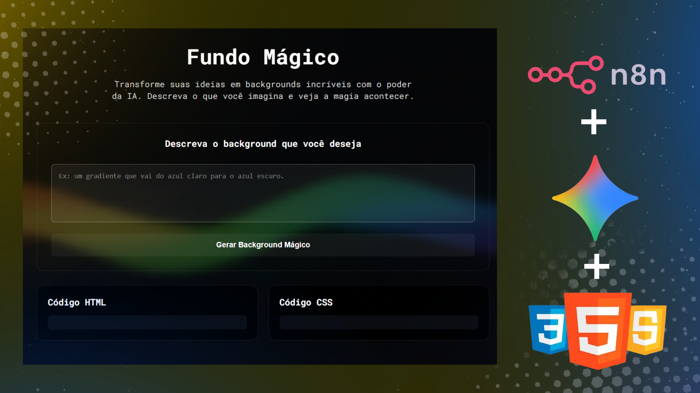

<div align="center">



# 🪄 Fundo Mágico com IA
### Gerando Backgrounds Criativos com IA

<p align="center">
  
  
  
</p>

</div>

---

## 🎯 Visão Geral do Projeto

```diff
! O Fundo Mágico é uma aplicação web inovadora concebida durante a "Semana do Zero ao Programador Contratado", um evento intensivo produzido pelo Dev em Dobro.
! O objetivo central da aplicação é permitir que qualquer usuário, independentemente de seu conhecimento técnico, consiga gerar backgrounds criativos e personalizados para sites.
! Através de uma interface intuitiva, a aplicação utiliza o poder da Inteligência Artificial Generativa para sugerir paletas de cores, texturas e conceitos visuais únicos.
! O projeto não é apenas uma interface simples, mas sim um ecossistema integrado que une o desenvolvimento web tradicional com as mais modernas ferramentas de automação e IA do mercado.
```

---

## ⚙️ Arquitetura e Funcionamento

```diff
- Camada de Interface (Front-end): Desenvolvida com HTML5, CSS3 e JavaScript. É responsável por capturar as intenções do usuário e exibir o resultado final de forma dinâmica.
- Camada de Automação (n8n): Atua como o "Back-end as a Service". O n8n recebe as requisições via Webhooks, processa os dados e gerencia o fluxo de informações entre o site e a IA.
- Camada de Inteligência (Google Gemini): A API do Google Gemini recebe os prompts estruturados pelo n8n e gera as sugestões criativas baseadas em modelos avançados de linguagem e visão.
- Fluxo de Dados: O JavaScript envia um sinal -> o n8n orquestra a chamada -> o Gemini responde -> o n8n devolve -> o site atualiza o fundo magicamente.
```

---

## 🚀 Tecnologias e Ferramentas

```diff
+ HTML5: Utilizado para a estruturação semântica de toda a aplicação, garantindo acessibilidade e boa indexação.
+ CSS3: Responsável por toda a parte visual, incluindo animações suaves e um layout responsivo que se adapta a diferentes tamanhos de tela.
+ JavaScript (ES6+): A alma da interatividade, gerenciando eventos de clique, manipulação do DOM e a comunicação assíncrona com o servidor de automação.
+ n8n: Uma ferramenta poderosa de workflow automation que permitiu criar uma API robusta sem a necessidade de escrever centenas de linhas de código back-end.
+ Google Gemini API: A tecnologia de ponta que fornece a "mágica" por trás das sugestões, trazendo o estado da arte da IA para dentro do projeto.
```

---

## 🤯 Desafios Superados e Evolução Técnica

O desenvolvimento do **Fundo Mágico** foi uma jornada de descoberta técnica. O maior desafio foi, sem dúvida, estabelecer uma comunicação estável e segura entre o front-end e o **n8n**. Foi necessário compreender profundamente como funcionam os **Webhooks** e como tratar as respostas da API para que o usuário tivesse um feedback imediato.

Além disso, a estruturação dos prompts para o **Google Gemini** exigiu testes e refinamentos para garantir que os backgrounds gerados fossem realmente úteis e visualmente agradáveis. Ver todo esse fluxo — que envolve três camadas tecnológicas distintas — funcionando perfeitamente foi uma experiência extremamente gratificante que consolidou meus conhecimentos em integração de sistemas e IA.

---

## 🤝 Autoria e Créditos

<div align="center">

Este projeto foi desenvolvido com dedicação por:

**Érica Bonfanti Corrêa**
[GitHub](https://github.com/EricaBonfanti) | [LinkedIn](https://www.linkedin.com/in/ericabonfanti/)

---

<sub>**Este projeto é um reflexo de aprendizado real, prática intensa e evolução constante como desenvolvedora.**</sub>

</div>

